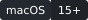

# 3MF Quick Look

[](LICENSE)
[](#requirements)
[](https://github.com/trsdn/threemf-quicklook/actions/workflows/ci.yml)
[](https://github.com/trsdn/threemf-quicklook/releases/latest)
[](docs/self-assessment.md)

Finder previews and thumbnails for `.3mf` 3D-printing files, so a folder of models looks like a
folder of models instead of a wall of identical generic icons.

Select a `.3mf` and press Space: you get the preview the slicer already rendered. Switch a folder to
icon view: you get thumbnails.

It reads files. It does not edit them, slice them, talk to printers, reach the network, or collect
anything.

## Installing

Download the latest DMG from [Releases](https://github.com/trsdn/threemf-quicklook/releases/latest),
drag the app to `/Applications`, then:

1. **Launch it once.** macOS only registers Quick Look extensions after their host app has run.
2. Refresh the registry: `qlmanage -r && qlmanage -r cache`

The build is signed with a Developer ID and notarized, so it opens without a Gatekeeper warning.

## Verifying it works

The honest way is to just look: select a `.3mf` in Finder and press Space.

To check from a terminal, confirm both extensions are registered and enabled — the leading `+`
means enabled:

```bash
pluginkit -mAvvv -p com.apple.quicklook.preview   | grep -A1 ThreeMF
pluginkit -mAvvv -p com.apple.quicklook.thumbnail | grep -A1 ThreeMF
```

`scripts/verify-quicklook.swift` asks macOS for a thumbnail through the same API Finder uses, and
prints its size:

```bash
swift scripts/verify-quicklook.swift ~/Downloads/some-model.3mf
# OK: 512x512
```

### A note on `qlmanage`

`qlmanage -t` **does not work with modern Quick Look extensions** and hangs indefinitely. It
launches the extension and then never sends it a request — a sample of the stalled process shows it
idle in its run loop, having been asked to do nothing. This is a `qlmanage` limitation, not a fault
in the extension: the same file returns a thumbnail in well under a second through
`QLThumbnailGenerator`, which is what Finder actually calls.

`qlmanage -p` does work, but it opens a preview window and stays running until you close it, which
looks like a hang in a script.

Use `scripts/verify-quicklook.swift` instead. `qlmanage -r` is still the correct way to refresh the
registry.

## Requirements

- macOS 15 or later, Apple silicon or Intel
- To build: Xcode 26 or later and [XcodeGen](https://github.com/yonaskolb/XcodeGen)
  (`brew install xcodegen`)

## Building

```bash
xcodegen generate
xcodebuild -project ThreeMFQuickLook.xcodeproj -scheme ThreeMFQuickLook \
           -destination 'platform=macOS' CODE_SIGNING_ALLOWED=NO build
```

`ThreeMFQuickLook.xcodeproj` is generated from `project.yml` and is also committed. After changing
`project.yml`, regenerate and commit the result — CI fails on a stale project.

## How it works

The 3MF parsing and preview extraction live in [ThreeMFKit](https://github.com/trsdn/ThreeMFKit),
pinned here by exact version because this bundle is notarized and its inputs must be reproducible.
That package has its own tests; this repository holds the two Finder extensions and the host app.

A `.3mf` is a ZIP container into which slicers write rendered previews. They disagree on where and
how many, and some of those images are per-object picking masks that look nothing like the model.
Choosing the right one is the interesting part, and it lives in ThreeMFKit.

The extensions also register for `public.zip-archive`, because a slicer that claims the `.3mf` type
would otherwise stop them from ever being asked. That means they are handed ordinary ZIP files too,
and must decline them rather than pulling out some unrelated image.

## Security

These extensions run on files you have merely selected in Finder, before you have opened anything,
and those files come from the internet. See [SECURITY.md](SECURITY.md) for the threat model and how
to report a vulnerability.

Releases are signed and notarized through
[macos-notarization-broker](https://github.com/trsdn/macos-notarization-broker), which builds this
source without Apple credentials present and gates certificate use behind a manual approval, so no
credential ever reaches this repository.

## Project conventions

Contributions and ownership are in [CONTRIBUTING.md](CONTRIBUTING.md). Automated agents should read
[AGENTS.md](AGENTS.md) first.

This repository is assessed against the
[trsdn Repository Quality Standard](https://github.com/trsdn/.github); the evidence is in
[docs/self-assessment.md](docs/self-assessment.md).

## Related

- [ThreeMFKit](https://github.com/trsdn/ThreeMFKit) — the 3MF reading and preview extraction package
- [Print File Manager](https://github.com/trsdn/printfilemanager) — a library manager for large
  `.3mf` collections, built on the same package

## License

MIT — see [LICENSE](LICENSE).
